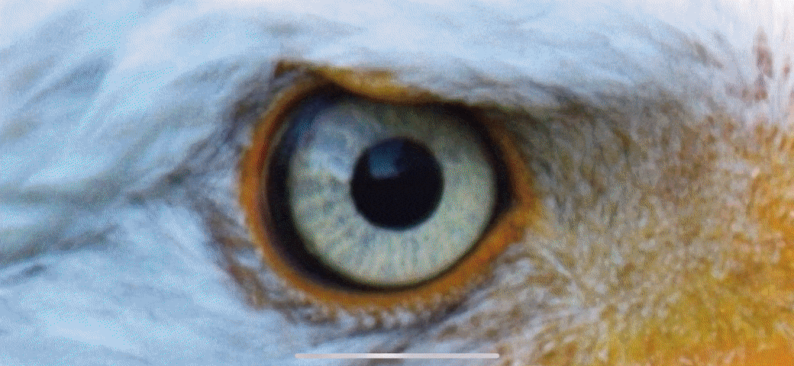

A **WWDC19** scholarship submission.

## Description

The project showcases how different animals (dogs, cats, bulls, birds, snakes and bees) see the world by simulating their eye sight with CoreImage filters applied to live camera preview in comparison to human eye sight.

Technologies used: AVFoundation, CoreGraphics, CoreLocation, CoreImage, Metal, SIMD, UIKit.

## Running

This project is distributed both as an app and a playground. The app was used during the development and debugging and the playground was used as the actual submission.

### App

Running this project as an app requires **Xcode 10.1 or newer** and **iOS 12.1 or newer**. Both iPhone and iPad are supported as destination devices. After cloning the repository, open [Project/Sight.xcodeproj](Project), change the code signing settings in [Configuration/Sight.xcconfig](Configuration/Sight.xcconfig) and run the app on your destination device.

### Playground

Running this project as a playground requires **Swift Playgrounds 2.2 or newer** running on **iOS 12.1 or newer**. After cloning the repository, you can copy [Playground/Sight.playground](Playground) directly to Swift Playgrounds app.

## About

This project was made with sweat 😪 and caffeine ☕️ with a tbsp of hope 🤞 by Adrian Kashivskyy.

### License

This project is licensed under the [Creative Commons BY-SA 4.0 License](LICENSE.txt).

All photographs used in the project are licensed under the [Pexels Photo License](https://www.pexels.com/photo-license/). All medical illustrations used in the project come from [Wikimedia](https://commons.wikimedia.org/wiki/Main_Page) and are licensed under the [CC-BY-SA-3.0 License](https://creativecommons.org/licenses/by-sa/3.0/). All icons used in the project come from [Icons8](https://icons8.com). The redistribution of [xcconfigs](https://github.com/netguru/xcconfigs) is licensed under the [MIT License](https://github.com/netguru/xcconfigs/blob/master/LICENSE.md).
